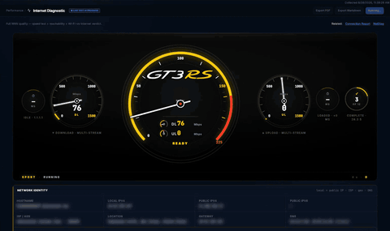
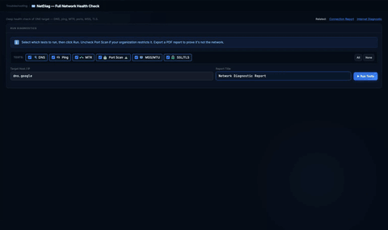
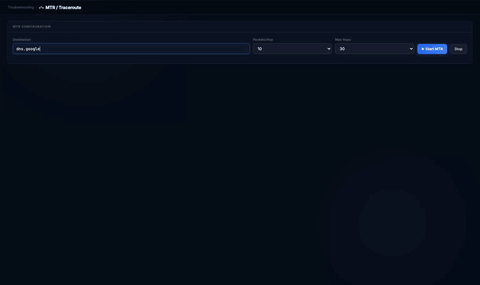
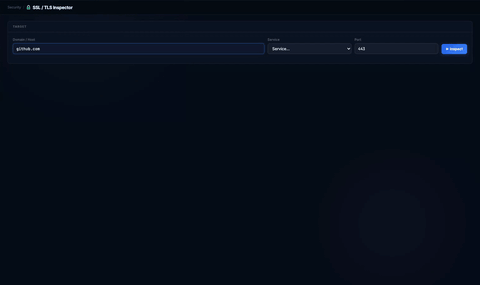
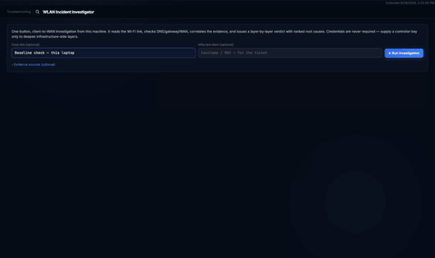
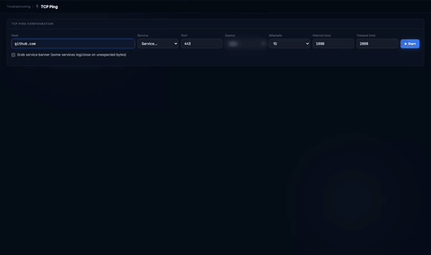
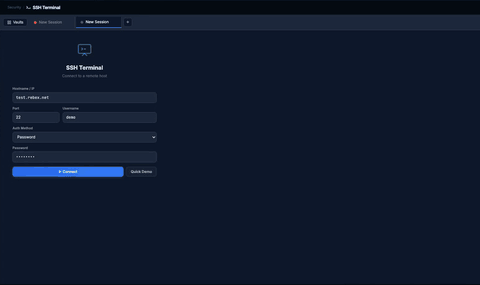

 
 

# VIQ Network Toolset

### The network engineer's troubleshooting toolkit

**VIQ Network Toolset** is the network engineer's troubleshooting toolkit from Virtual IQ AI — a desktop application that bundles 30+ tools: SNMP port mapping, ping, MTR/traceroute, TCP ping, DNS, WHOIS and BGP ASN lookup, SSL/TLS inspection, switch health, configuration audit, Wi-Fi/WLAN diagnostics, internet speed diagnostics, subnet calculator, SSH terminal and SCP/SFTP server — in one local installer for Windows and macOS. It runs entirely on the workstation, needs no cloud account, sends no telemetry, and is read-only toward network devices by design. Free for personal and non-commercial use.

 

 

[**⬇ Download Latest Release**](https://github.com/virtualiqai/viq-network-toolset/releases/latest) &nbsp;|&nbsp;
[**🎬 Tool demos**](./demos/README.md) &nbsp;|&nbsp;
[**📋 Changelog**](./CHANGELOG.md) &nbsp;|&nbsp;
[**🔐 Security & Privacy**](./SECURITY.md) &nbsp;|&nbsp;
[**📜 Terms of Use**](./TERMS_OF_USE.md) &nbsp;|&nbsp;
[**💬 Report an Issue**](https://github.com/virtualiqai/viq-network-toolset/issues)

 

---

## Overview

VIQ Network Toolset is a desktop network operations workbench built by a working network architect, for working network engineers. Every tool addresses a real operational task: discovery, troubleshooting, security verification, performance measurement, or day-to-day reference. The application runs entirely on your workstation, requires no cloud account, and performs all device interactions in real time against the targets you point it at.

It is distributed as a single installer for Windows and macOS. Once installed, it launches in your default browser at a private loopback address and exposes its full tool catalog through a clean, dark-themed interface.

> **3.1.1 is the current stable release.** It carries the hardened localhost API boundary, encrypted credential vault, contained file transfer and redacted Config Audit exports from the 3.0 security work, and the Windows installer now removes any earlier installation before installing. Everyone on 3.0.x should upgrade.
>
> **The 3.0 stable line** brings the full **WLAN Investigator** suite (Wi-Fi diagnostics, roaming, DHCP, RADIUS, AP uplink, RF reference), **verdict-led PDF reporting across every tool**, and an **Internet Diagnostic measurement engine** aligned with industry speed-test methodology. Early access to what's next ships in the [**beta channel**](https://github.com/virtualiqai/viq-network-toolset-beta).

---

## Tool demos

Each demo shows a real run of the shipped build: what the tool answers, how to run it, how to read the result, how to export it, and what to do when it doesn't work. Values that would identify the capturing machine are blurred.

| | |
|---|---|
|  | **[Internet Diagnostic](./demos/internet-diagnostic.md)** Is this internet connection good enough for the work people do on it, and if not, what exactly is wrong? Per-workload verdicts (voice, video, VDI, backups) with the measurements behind them. |
|  | **[NetDiag Report](./demos/netdiag-report.md)** Is the network the problem for this one host? DNS, latency, path, ports, MTU and certificate in one run, one verdict, one report. |
|  | **[MTR / Traceroute](./demos/mtr-traceroute.md)** Where on the path does latency or loss begin, and whose network is it? Hop-by-hop loss and latency with reverse DNS and ASN per hop, and a report for the ticket. |
|  | **[SSL / TLS Inspector](./demos/ssl-tls-inspector.md)** Is the certificate on this host valid, who issued it, when does it expire, and what did the handshake negotiate? One handshake from the workstation, graded, with a report. |
|  | **[WLAN Investigator](./demos/wlan-investigator.md)** Is the Wi-Fi the reason this laptop's connection is bad, and if so, at which layer? One run from the client, nine layers from radio to WAN, ranked root causes, a ticket-ready report. |
|  | **[TCP Ping](./demos/tcp-ping.md)** Does this host answer on this port right now, and how consistently? One handshake per attempt where ICMP is filtered, with latency, jitter and loss, and a report. |
|  | **[SSH Terminal](./demos/ssh-terminal.md)** Can you reach a device's command line from the toolset, with host-key checks, saved sessions and keys? Tabs, vaults and snippets beside the tools that pointed you at the device. |

More demos: [demos/](./demos/README.md).

---

## Tool Catalog

### Discovery

| Tool | Description | Method |
|---|-------|----|
| **SNMP Port Mapper** | Walks a switch and correlates IF-MIB, BRIDGE-MIB, Q-BRIDGE-MIB, IP-MIB, LLDP-MIB, and CDP-MIB to produce a full port → MAC → IP → neighbor map; works across Cisco IOS / Catalyst / NX-OS (incl. pure-L2 Nexus access with no SVIs); optional L3 ARP correlation against a separate router (legacy `ipNetToMediaTable` + RFC 4293 fallback); structured diagnostic cards explain L2 / L3 failures with actionable checks | SNMP v1/v2c/v3 GET/GETBULK (read-only) |
| **Ping Sweep** | Sweep a CIDR for live hosts (capped at 254 hosts) | ICMP echo |
| **DNS Lookup** | A, AAAA, CNAME, MX, NS, TXT, SOA, PTR records | DNS UDP/53 |
| **WHOIS** | Domain and IP WHOIS lookup | TCP/43 |
| **BGP ASN Lookup** | ASN owner, country, and announced-prefix counts via the RIPE NCC's public RIPEstat API, enriched with registry RDAP org/abuse data | HTTPS to stat.ripe.net + registry RDAP (ARIN / RIPE / APNIC) |
| **MAC Address Lookup** | OUI vendor identification | Offline OUI table |

### Troubleshooting

| Tool | Description | Method |
|---|-------|----|
| **NetDiag Report** | Streaming combined DNS + ping + MTR + port scan + MSS probe + SSL diagnostics for a single host — [demo](./demos/netdiag-report.md) | SSE (Server-Sent Events); mix of ICMP, TCP, DNS, TLS |
| **Ping** | Single-host ICMP ping | System ping |
| **MTR / Traceroute** | Hop-by-hop latency and loss — [demo](./demos/mtr-traceroute.md) | System mtr or traceroute |
| **TCP Ping** | Handshake-based reachability and latency to a host:port, useful where ICMP is filtered — [demo](./demos/tcp-ping.md) | TCP connect |
| **fping** | Parallel multi-host ping (capped at 20 hosts) | System fping |
| **Port Scanner** | Native per-host TCP/UDP port check with banner grab (capped at 100 ports). Replaces the former **Nmap Scanner** - no external `nmap` binary is required | Native TCP connect / UDP probe |
| **Switch Health** | Runs a strict allowlist of `show` commands over SSH and parses CPU, temperature, fans, PSU, and uptime; auto-detects IOS-XE vs NX-OS and runs the correct environment command. Hard-blocked from `configure`, `reload`, `clear`, `copy`, `write`, `erase` | SSH TCP/22 (read-only) |
| **Config Audit** | Static audit of a pasted device configuration (Cisco / Arista / NX-OS style) for weak SNMP communities, telnet, default credentials, and missing logging; side-by-side startup-vs-running diff | Local text analysis + SSH TCP/22 (read) |
| **WLAN Investigator** | One-button, client-to-WAN Wi-Fi investigation from this machine: reads the link (SSID, BSSID, RSSI, SNR, channel, security), scans nearby networks, checks DHCP, DNS, gateway, WAN and captive portal, and issues a nine-layer verdict with ranked root causes and a ticket-ready report; optional RADIUS probe, AP-uplink (switch SNMP) and controller evidence deepen the infrastructure layers — [demo](./demos/wlan-investigator.md) | Local Wi-Fi API; DHCP, DNS, ICMP, TCP and HTTP probes; optional SNMP and RADIUS |

### Security

| Tool | Description | Method |
|---|-------|----|
| **SSL / TLS Inspector** | Certificate issuer, expiry and days remaining, the negotiated TLS version and cipher, Subject Alternative Names, and a grade for the handshake — [demo](./demos/ssl-tls-inspector.md) | TLS handshake |
| **Ncat / Netcat** | Reference and command-builder UI | Informational only |
| **SSH Terminal** | In-browser xterm.js terminal to a target device (password, RSA, Ed25519, ECDSA, or DSS key, with a system-`ssh` fallback) — [demo](./demos/ssh-terminal.md) | SSH TCP/22 |
| **SCP / SFTP Server** | Runs a local SFTP/SCP server so devices can push configurations to the workstation; native folder picker on both macOS (Finder) and Windows (Explorer) for the root directory | SSH TCP (configurable port) |

### Performance

| Tool | Description | Method |
|---|-------|----|
| **Internet Diagnostic (Speed Test)** | Streaming WAN speed test - multi-CDN download/upload throughput, idle vs loaded latency, DNS/path/MTU probes, a gauge cluster, and per-workload verdicts (VoIP, video calls, gaming, VDI, streaming, VPN, and more) with root-cause findings — [demo](./demos/internet-diagnostic.md) | SSE; HTTPS to public speed-test endpoints |
| **SockPerf** | TCP and UDP latency and throughput probe with built-in listener mode | TCP/UDP socket |
| **Bandwidth Calculator** | Throughput, transfer-time, and link-utilization math | Offline |
| **MSS Calculator** | Path MTU/MSS dual-probe (jumbo 9000 and standard 1500, DF-bit) - classifies jumbo, standard, tunnel-overhead, or fragmented paths | ICMP DF-bit probe |

### Utilities & Reference

| Tool | Description | Method |
|---|-------|----|
| **Subnet Calculator** | IP/CIDR math, broadcast, usable range, and wildcard mask; enumerates every `/N` block inside a user-selected parent network (Auto = 64 sibling blocks, or pin to `/24`, `/22`, etc.); input subnet highlighted in the table and PDF export | Offline |
| **IP Converter** | Base and format conversions for IPv4 and IPv6 | Offline |
| **IP Info** | Public-IP autodetect, geolocation, and PTR record | HTTPS to api.ipify.org and ipwho.is |
| **Wake-on-LAN** | Send a magic packet to wake a host | UDP broadcast or unicast |
| **Port Reference** | Searchable port-to-service mapping | Offline |
| **CIDR Table** | CIDR-to-netmask reference | Offline |
| **Activity Log** | Local audit log of every API call - method, path, status, duration; credentials redacted before insert; auto-purges after 14 days. See [SECURITY.md](./SECURITY.md) | Local SQLite |
| **Wishlist** | Submit feature requests stored locally | Local |
| **About / Version** | Build information, update check, and release-channel selection | Local + version check |

> **Read-only by design.** With the exception of the SSH Terminal (operator-typed commands) and the optional SCP/SFTP Server (accepts inbound file pushes), the toolset issues no writes to target devices - no SNMP SET, no configuration commands, no `reload`, `write`, `erase`, or `clear`.

---

## Reporting

Many tools export a **Virtual IQ AI-branded PDF report** summarizing their findings. The fully standardized, color-coded, **verdict-led reporting suite that spans every tool** - plus real `.xlsx` export for MAC Address Lookup and the SNMP Port Mapper - is available now in the [3.0 beta channel](https://github.com/virtualiqai/viq-network-toolset-beta) and will land on the stable line in a future release.

---

## Why This Toolset

- **Comparable scope to commercial engineer toolsets** - discovery, troubleshooting, security, performance, and reference tools that traditionally require multiple separate utilities or a $1,500+ commercial license, consolidated into one application.
- **Runs entirely local** - no cloud account, no telemetry, no analytics. Outbound connections are limited to a single GitHub version-check at startup plus a small number of opt-in lookups (IP geolocation, ASN/RDAP) that only fire when the user clicks the corresponding tool.
- **Read-only safety by default** - the toolset will not modify a device configuration. Switch Health enforces this in code with a hard allowlist.
- **Real engineering** - built and refined against production enterprise infrastructure, not simulated labs.
- **One installer, no dependencies** - no Python install, no Docker, no Node, no npm. Download, install, launch.

---

## System Requirements

| Component | Requirement |
|------|-------|
| Windows | Windows 10 1809 or later / Windows 11 (x64) |
| macOS | macOS 12 (Monterey) or later (Apple Silicon - arm64) |
| RAM | 512 MB minimum, 1 GB recommended |
| Disk | ~100 MB installed |
| Browser | Latest Chrome, Edge, Firefox, or Safari (auto-launched at startup) |
| Network - outbound | SNMP UDP/161, SSH TCP/22, DNS UDP/53, WHOIS TCP/43, ICMP, plus arbitrary TCP for the port scanner and SSL inspector |
| Network - inbound | Loopback only (`127.0.0.1`). The application binds to localhost; it never accepts external connections |

No Python installation, runtime, or other dependencies are required - everything is bundled.

---

## Installation

### Windows

1. Download `VIQ-Network-Toolset-Setup.exe` from the [latest release](https://github.com/virtualiqai/viq-network-toolset/releases/latest)
2. Double-click the installer to launch
3. Follow the prompts - the installer registers the application under **Add/Remove Programs** as **VIQ Network Toolset**
4. Launch from the Start Menu - your default browser will open automatically

### macOS

1. Download `VIQ-Network-Toolset.dmg` from the [latest release](https://github.com/virtualiqai/viq-network-toolset/releases/latest)
2. Open the DMG and drag the application to your **Applications** folder
3. Launch from Applications or Spotlight - your default browser will open automatically

> The installer is approximately **27 MB on Windows** and **31 MB on macOS**.

---

## First-Run Security Warnings

This release is distributed as an independent, non-store binary. Because the publisher's binaries have not yet built a reputation with Microsoft SmartScreen, and macOS Gatekeeper requires Apple Developer ID notarization, both operating systems may display a security warning on first launch. **This is expected for any independent software publisher** and does not indicate that the software is malicious. The security posture is documented in [SECURITY.md](./SECURITY.md).

### Windows - Microsoft SmartScreen

On first launch you may see: *"Windows protected your PC."*

1. Click **More info**
2. Click **Run anyway**

After a small number of installs across the user community, SmartScreen will begin recognizing the publisher automatically. A future release will be signed with a code-signing certificate to eliminate this warning entirely.

### macOS - Gatekeeper

On first launch you may see: *"VIQ Network Toolset cannot be opened because Apple cannot check it for malicious software"* or *"App is from an unidentified developer."*

**Option 1 - Right-click open:**
1. In Applications, right-click (or Control-click) the app
2. Choose **Open**
3. Click **Open** in the confirmation dialog

**Option 2 - System Settings:**
1. Try to open the app normally (it will be blocked)
2. Open **System Settings → Privacy & Security**
3. Scroll to the bottom - you'll see the blocked app
4. Click **Open Anyway**

A future release will be fully notarized through the Apple Developer Program to eliminate this warning entirely.

---

## Shutting Down Properly

⚠️ **Closing your browser does not stop the application.** The backend continues running in the background.

To shut down cleanly:

- **In-app:** Click the **Shutdown** button in the application header
- **Windows:** Right-click the system-tray icon and choose **Quit**
- **macOS:** Use the in-app Shutdown button (no menu-bar icon)

If you close the browser without shutting down, simply reopen the application's URL (it is printed in the launcher window) and use the Shutdown button.

---

## Privacy & Telemetry

VIQ Network Toolset is designed to be transparent about every outbound connection. Network traffic from the toolset itself falls into three categories:

1. **Targeted device traffic** - SNMP, SSH, ICMP, and TCP probes go directly to whatever device or host you point the tool at.
2. **Version check (always-on at startup)** - A single HTTPS GET to either `raw.githubusercontent.com/virtualiqai/viq-network-toolset/main/version.json` (stable channel) or `raw.githubusercontent.com/virtualiqai/viq-network-toolset-beta/main/version.json` (beta channel) depending on the channel selected on the About page, to check whether a newer release is available. No system information, IP address, or identifier is sent.
3. **Opt-in third-party lookups (only when you click the tool)** - `api.ipify.org` and `ipwho.is` for the **IP Info** tool, and RDAP queries to `rdap.arin.net`, `rdap.db.ripe.net`, and `rdap.apnic.net` for **BGP ASN Lookup**.

The application performs **no telemetry, no analytics, no crash reporting, and no usage tracking.** Full details are in [SECURITY.md](./SECURITY.md).

---

## Roadmap

Planned for future releases:

- **AI-augmented network operations platform** - predictive incident detection, autonomous Level-1 triage, and natural-language network querying. In active development.
- Signed Windows installer (Authenticode)
- Notarized macOS application (Apple Developer ID)
- Linux build
- Multi-vendor Switch Health parser (Arista EOS, Juniper Junos, PAN-OS)
- Full IPv6 parity across all tools

---

## About Virtual IQ AI

**Virtual IQ AI · USA** builds AI-augmented network operations tooling for working engineers. The toolset is designed and maintained by a practicing network architect with roughly two decades of hands-on experience across enterprise data centers, healthcare, and multi-cloud environments, and reflects real production operational needs rather than lab simulations. VIQ Network Toolset is the first publicly released product; an AI-augmented network operations platform follows (see Roadmap).

---

## Legal

This software is proprietary and distributed in compiled-binary form only. The source code is not publicly available.

- **License:** Free for personal and non-commercial use; commercial use requires a separate written license. See [LICENSE](./LICENSE) for full terms.
- **Terms of Use:** Plain-English acceptable-use policy in [TERMS_OF_USE.md](./TERMS_OF_USE.md).
- **Third-party components:** Open-source library, data, and asset acknowledgments in [THIRD_PARTY_LICENSES.md](./THIRD_PARTY_LICENSES.md).
- **Trademarks & affiliation:** All third-party product names and logos are the property of their owners, used for identification only; no affiliation or endorsement is implied. See [NOTICE.md](./NOTICE.md).

© 2026 Virtual IQ AI · USA. All rights reserved.

---

## Contact

- **Email:** info@virtualiqai.com
- **GitHub:** [github.com/virtualiqai](https://github.com/virtualiqai)
- **Stable-channel issues & feature requests:** [github.com/virtualiqai/viq-network-toolset/issues](https://github.com/virtualiqai/viq-network-toolset/issues)
- **Beta-channel issues:** [github.com/virtualiqai/viq-network-toolset-beta/issues](https://github.com/virtualiqai/viq-network-toolset-beta/issues)

---

**Virtual IQ AI · USA** &nbsp;·&nbsp; Built by engineers, for engineers.

