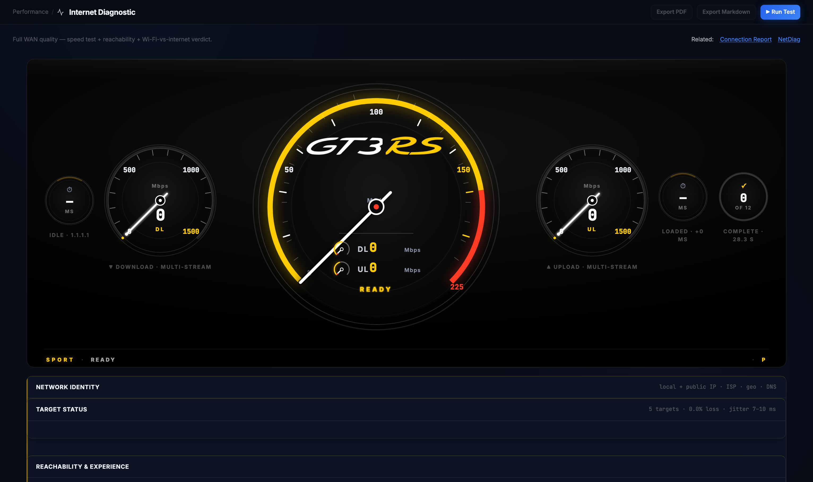
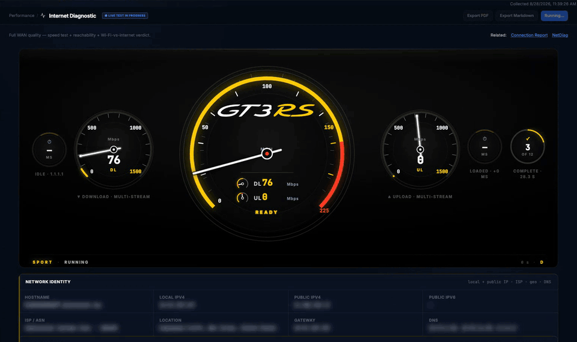
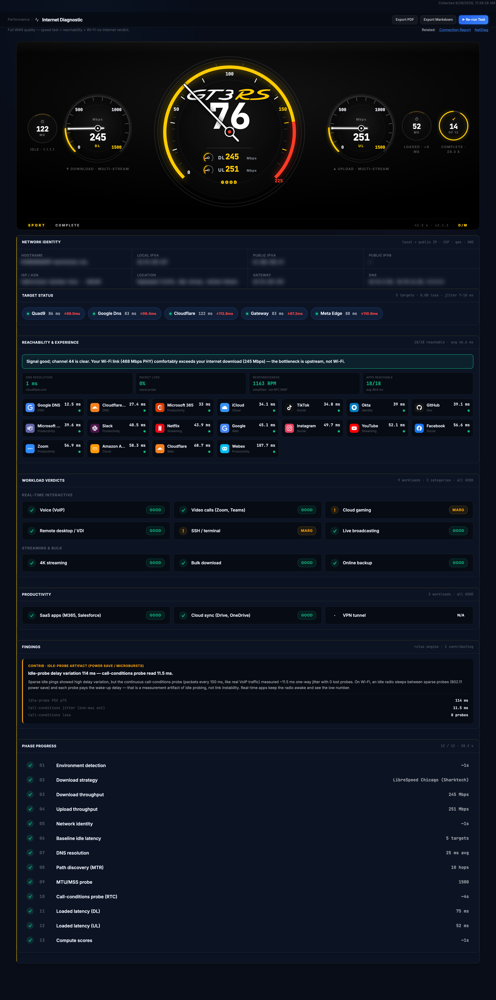
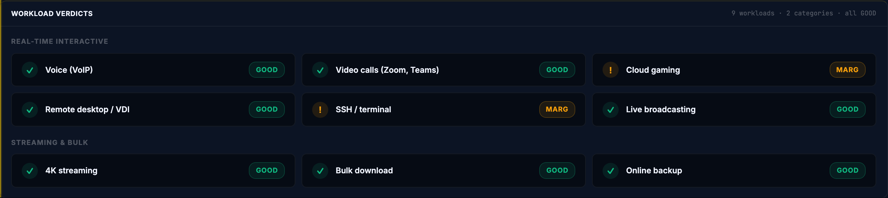
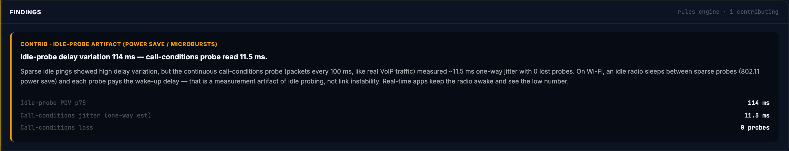
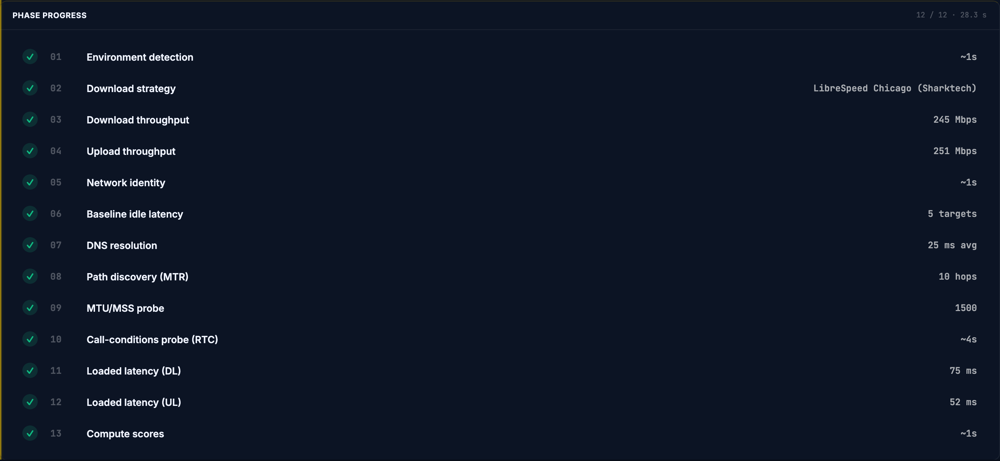
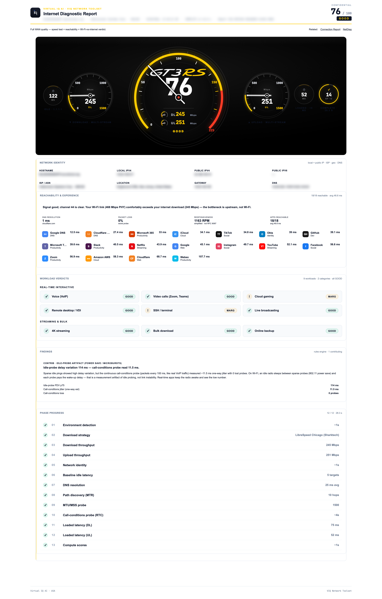

# Internet Diagnostic

**Is this internet connection good enough for the work people do on it, and if not, what exactly is wrong?**

Reach for it when someone says "the internet is slow" and you need a verdict per workload (voice, video calls, VDI, backups) with the measurements behind it, not just a download number.

## Before you start

| | |
|---|---|
| Inputs | None. The test runs from the machine you are on, against public endpoints. |
| Duration | About 45 seconds. Progress streams live; you can watch each phase complete. |
| Network use | Outbound HTTPS to public speed-test endpoints (several CDNs), timed TCP connects to Cloudflare, Google and Quad9, one path-discovery (MTR) run. Nothing inbound. |
| On Wi-Fi | The result includes a Wi-Fi-versus-internet verdict (is the bottleneck your link or upstream?). On macOS the app needs Location Services to read the Wi-Fi link details. |
| For a clean reading | Stop large transfers and video calls on this machine first. Corporate proxies and TLS-inspection gateways shape the result; that is usually the real answer, not an error. |

> Note: the report names this machine, its addresses, ISP and location. Treat exported reports as confidential; they carry a CONFIDENTIAL mark for that reason. Values in the screenshots below are blurred.

## Running it

Open **Performance → Internet Diagnostic** and click **Run Test**. The gauge cluster sits at READY; there is nothing to configure.

Shown at about 5× speed; a real run takes around 45 seconds and ends on the score. The phases run in sequence: environment, download strategy, download, upload, network identity, idle latency to five targets, DNS, path discovery, MTU/MSS, the call-conditions probe, loaded latency during download and during upload, then scoring. The needles move as throughput is measured and the status strip shows the elapsed time.

## Reading the result

**Score and grade (centre dial).** A 0–100 score with a word (GOOD, FAIR, POOR) summarising the whole run. The two small readouts under it are the download and upload headline figures. Read the word first; the number only matters for comparing two runs.

**Download and upload dials.** Headline throughput in Mbps, measured with multiple parallel streams across the fastest reachable endpoints and reported as a trimmed mean over the steady part of the transfer, so a slow ramp-up does not drag the number down. Which servers were used is recorded in the report.

**Idle latency (left dial), loaded latency and completion (right dials).** The left dial is round-trip time to a reference target while the line is quiet. The small right dials show loaded latency, the same measurement taken while the download and upload were saturating the line, and how many phases completed. A large gap between idle and loaded latency is bufferbloat and is the usual reason calls break up while a backup runs.

**Network Identity.** Hostname, local and public address, ISP and ASN, location, gateway and DNS servers, so the report is self-describing. Blurred in these screenshots.

**Target Status.** Round-trip time and jitter to five reference targets (Meta edge, Google DNS, your gateway, Quad9, Cloudflare). If your gateway is the slow one, the problem is inside your network.

**Reachability and Experience.** DNS resolution time, worst-probe packet loss, a responsiveness figure, and whether a set of common services (Microsoft 365, Zoom, Okta, GitHub, AWS and others) are reachable and how quickly. The sentence at the top of this panel is the Wi-Fi verdict: it compares your Wi-Fi link rate with the measured internet speed and says which one is the bottleneck.

**Workload Verdicts.** One verdict per kind of work. Real-time workloads (voice, video calls, cloud gaming, remote desktop, SSH, live broadcasting) are judged only on the call-conditions probe: a train of timed connections at 100 ms intervals to three targets for at least 12 seconds, with the median jitter across targets driving the verdict. That is why a link can show a poor idle-jitter figure and still be GOOD for voice: sparse idle pings wake a sleeping Wi-Fi radio and measure the wake-up delay, not the path. Streaming and bulk workloads are judged on throughput and loaded latency.

**Findings.** Plain-language explanations produced by the rules engine for anything that affected a verdict, with the numbers that triggered them. When a finding says a measurement is an artifact, the verdicts have already discounted it.

**Phase Progress.** Every phase with the figure it produced. If a phase did not complete, it says so here; the verdicts that depend on it are then marked rather than guessed.

## Export

**Export PDF** builds a print-ready report with the same panels and the run's identity line; **Export Markdown** writes the same content as text for a ticket or a chat message.

## When it doesn't work

| What you see | What it means | What to do |
|---|---|---|
| Download far below what the ISP sells | Multi-stream measurement to public CDNs; on a corporate network a proxy or shaper is often the real ceiling | Run once from a machine outside the proxy path; compare the endpoints named in the report |
| Voice GOOD but idle jitter looks bad | Idle probes on Wi-Fi measure radio power-save wake-ups, not the path | Trust the workload verdicts; the finding explains the gap |
| A phase shows no figure | The probe could not complete (blocked ICMP, filtered TCP, DNS timeout) | Check the phase named; verdicts that need it are marked, not invented |
| Loaded latency much higher than idle | Bufferbloat on the access line or router | Enable SQM/QoS on the router, or expect calls to degrade during bulk transfers |
| Wi-Fi verdict says the link is the bottleneck | Your Wi-Fi PHY rate is below the measured internet speed | Move, change band or channel, or test again on Ethernet |

---

Demonstrated on VIQ Network Toolset v3.1.1 (stable) · captured 2026-08-28 · Virtual IQ AI · USA
