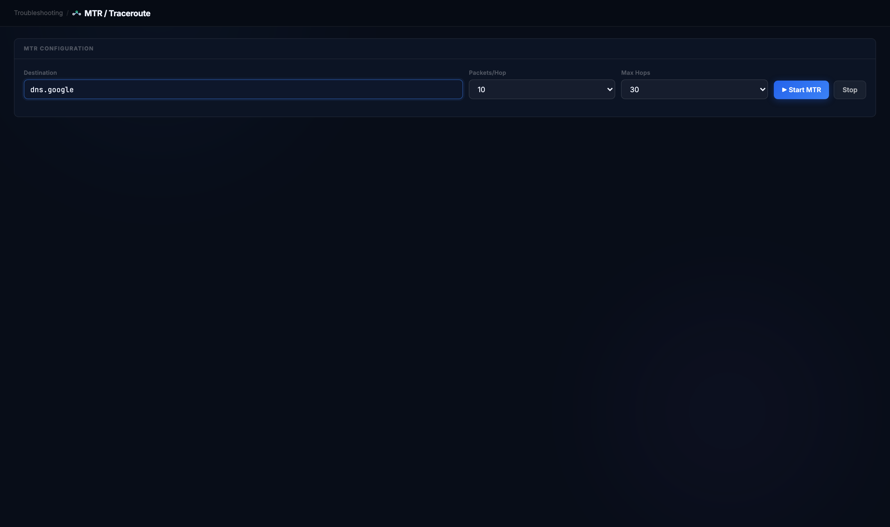
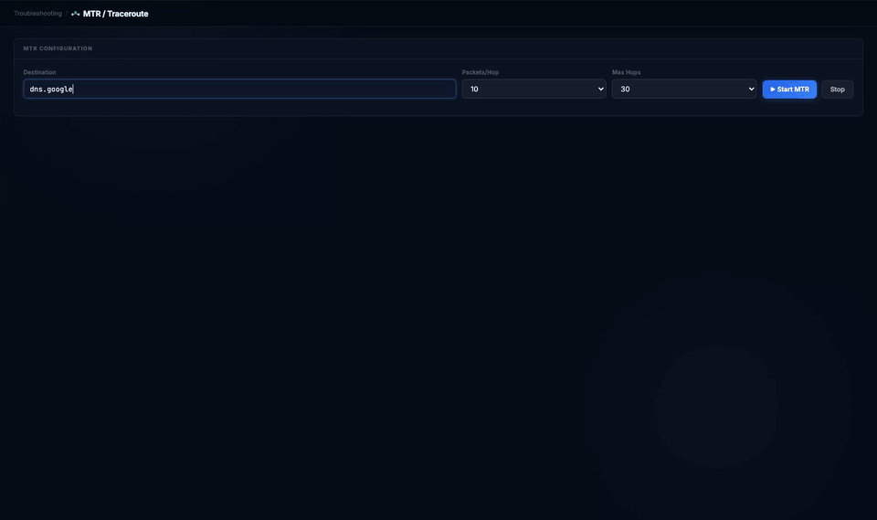
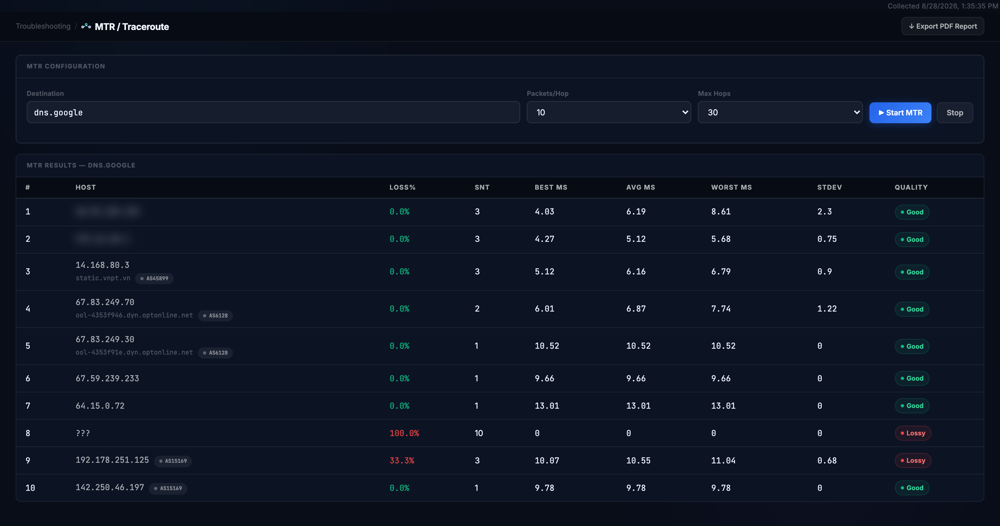
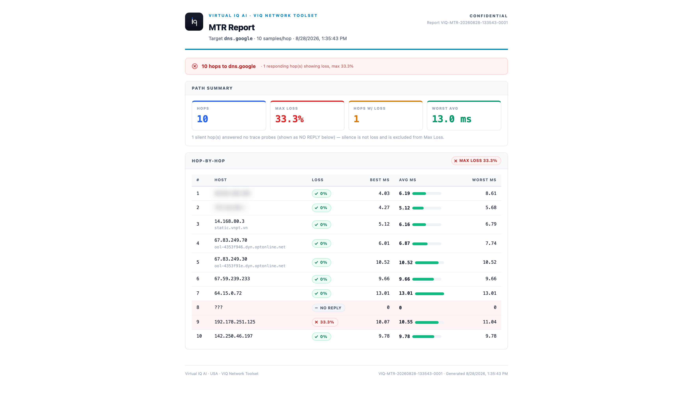

# MTR / Traceroute

**Where on the path does latency or loss begin?**

Reach for it when ping to a host is slow or lossy and you need to know which hop, and whose network, introduces it: yours, the ISP's, or the far end's.

## Before you start

| | |
|---|---|
| Inputs | A destination hostname or IP. Packets per hop (5, 10 or 20) and a hop limit (15 or 30). |
| Duration | Seconds. Hops stream into the table as they answer. |
| Network use | TTL-limited probes toward the destination, one hop at a time, plus reverse-DNS and ASN lookups for the hops that answer. Nothing inbound. |
| Samples | The SNT column is the number of probes each hop actually answered. Loss percentages are computed from that number, so with three samples a single dropped reply shows as 33%. Use more packets per hop before drawing conclusions from a single lossy hop. |

> Note: the first hops are your own network. They and this machine's source address are blurred in the screenshots below; treat exported reports as confidential.

## Running it

Open **Troubleshooting → MTR / Traceroute**, enter the destination, keep the defaults and click **Start MTR**. Rows appear as each hop answers; **Stop** ends the run early and keeps what has arrived.

The first seven hops answer within half a second, so that stretch is shown at quarter speed; the rest is real time, including the wait at hop 8, which never answers.

## Reading the result

**Host.** The hop's address, its reverse DNS name when one exists, and the ASN it belongs to. The ASN chips are what tell you whose network you are looking at: the hand-off from your ISP's ASN to the destination's ASN is usually the hop that matters.

**Loss% and SNT.** Loss as a share of the samples that hop was sent. Read them together: 33% of 3 samples is one lost reply. A transit router that rate-limits its ICMP replies looks exactly like this while forwarding your traffic perfectly. Loss that begins at a hop and continues through every hop after it, to the destination, is real. A `???` row is a hop that answered none of its probes: the table counts it as 100% loss, but when the hops after it answer, as here, it is a router that does not reply to TTL-expiry probes, not a break in the path.

**Best / Avg / Worst / StDev.** Round-trip time to that hop in milliseconds and how much it varied. Average rising sharply at one hop and staying high afterwards marks where the delay is introduced; a single high worst value with a low average is a queue, not a path problem.

**Quality.** Good, Marginal or Lossy per hop, from that hop's own loss; a silent hop is Lossy too. The destination row's pill is the one that summarises the path for the user.

## Export

**Export PDF Report** opens a report with the target, samples per hop and run time, a path summary (hops, maximum loss, hops with loss, worst average) and the hop-by-hop table with latency bars.

The banner and the Max Loss tile take the worst responding hop on the path, transit hops included. A hop that answered nothing is listed as NO REPLY and left out of Max Loss: silence is not loss. When the destination row shows 0%, as here, the path delivered every probe; read the banner as "one router on the way rate-limits ICMP, another does not answer at all".

## When it doesn't work

| What you see | What it means | What to do |
|---|---|---|
| `???` rows in the middle, destination reached | Routers that never answer TTL-expiry probes | Nothing; the path is fine if later hops answer |
| `???` rows to the end, destination never reached | A firewall dropping probes, or the host down | Confirm with TCP Ping on a port the host serves |
| Loss on one transit hop only | ICMP rate-limiting at that router | Ignore it; check the destination row |
| Loss starting at a hop and continuing to the end | Real loss from that hop onward | That hop's ASN owns the problem; include the export in the ticket |
| Average jumps at one hop and stays high | Latency added at that hop (long-haul link, congestion) | Compare with a run to another destination on the same ISP |
| Loss looks high but SNT is 1–3 | Too few samples for the percentage to mean much | Raise Packets/Hop to 20 and run again |

---

Demonstrated on VIQ Network Toolset v3.1.1 (stable) · captured 2026-08-28 · Virtual IQ AI · USA
