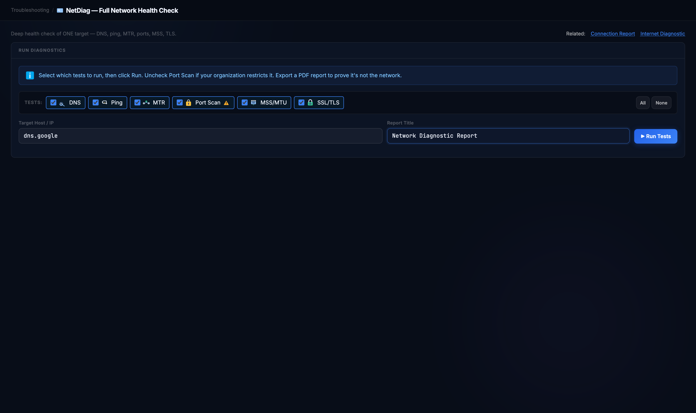
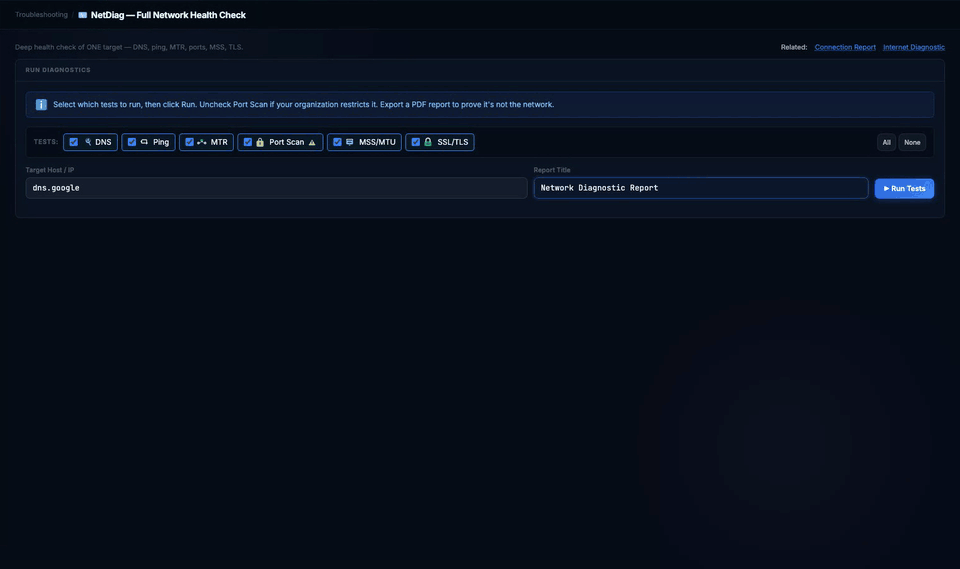
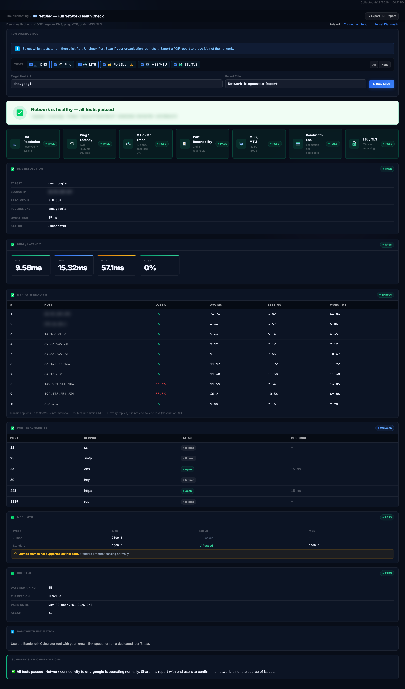
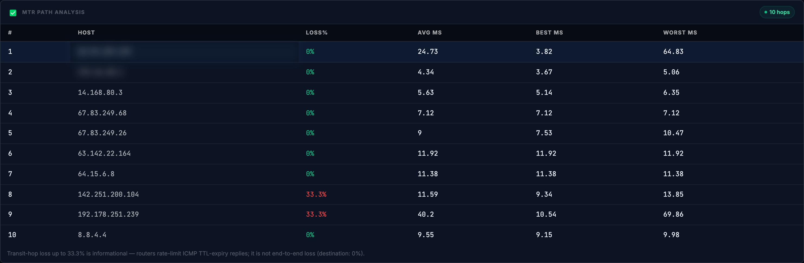
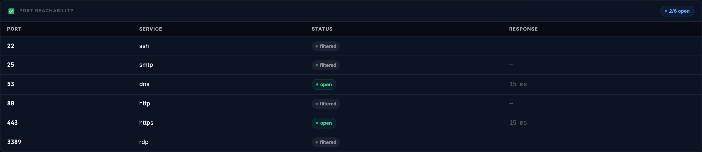
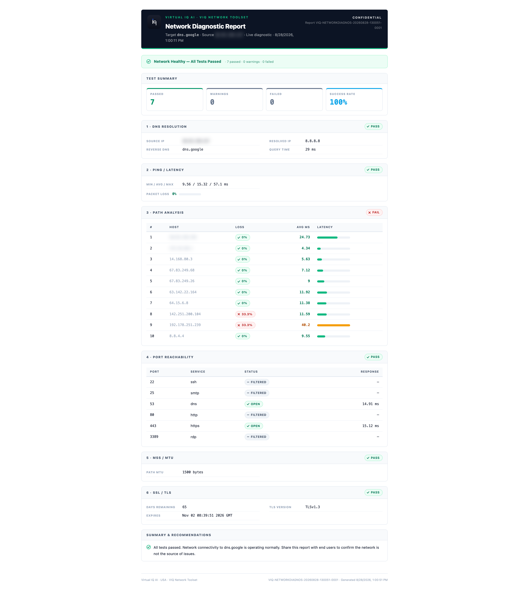

# NetDiag Report

**Is the network the problem for this one host? One run, seven checks, one verdict you can hand to whoever is asking.**

Reach for it when a user says "I can't get to X" or "X is slow" and you want DNS, latency, the path, the ports, the MTU and the certificate checked together, with a report that says which one broke.

## Before you start

| | |
|---|---|
| Inputs | A target hostname or IP. Optionally a report title, and which of the six tests to run (All / None). |
| Duration | Under a minute for all tests; the page fills in as each test finishes. |
| Network use | A DNS query, ICMP ping, an MTR path trace, TCP connects to six common ports (22, 25, 53, 80, 443, 3389), DF-bit MTU probes, and one TLS handshake on 443 when the target is a hostname. Nothing inbound. |
| Port Scan | Probes six ports on the target. Only point it at hosts you are allowed to test; untick Port Scan if your organisation restricts it (the test carries a warning mark for that reason). |
| SSL/TLS | Runs for hostnames only; for a bare IP the check is skipped and says so. |

> Note: the results and the exported report include this machine's source address and the first hops of your own network. Treat exported reports as confidential; they carry a CONFIDENTIAL mark. Those values are blurred in the screenshots below.

## Running it

Open **Troubleshooting → NetDiag Report**, enter the target, leave all six tests ticked and click **Run Tests**. The verdict banner appears first and the sections fill in beneath it as each test completes.

Shown at about 5× speed; a full run takes well under a minute.

## Reading the result

**Verdict banner.** One sentence for the whole run: healthy with every test passed, operational with minor warnings, or issues found, in the colour that matches. Beneath it, one card per test with its own PASS / WARN / FAIL pill and the headline figure (resolved address, average latency, hop count and destination loss, ports reachable, path MTU, certificate days remaining).

**DNS Resolution.** The address the name resolved to, the reverse name, the query time, and the source address the query left from.

**Ping / Latency.** Minimum, average and maximum round-trip time and packet loss to the target.

**MTR Path Analysis.** Every hop to the target with loss and best / average / worst latency. Loss on a transit hop that does not continue to the destination is a router rate-limiting its ICMP replies, not path loss; the footnote under the table says so and the verdict is taken from the destination, where loss was 0% here.

**Port Reachability.** Which of the six ports answered a TCP connect and how fast. "Filtered" means no answer at all, which on a well-run host is the normal state for ports it does not serve.

**MSS / MTU.** Two DF-bit probes, jumbo (9000 B) and standard (1500 B), and the MSS the path allows. A blocked jumbo probe with a passing standard probe is the expected result on almost every internet path and is labelled as such.

**SSL / TLS.** For hostnames: days until expiry, negotiated TLS version, expiry date and grade.

**Bandwidth Estimation.** Informational only; NetDiag does not run a throughput test. It points you to the Bandwidth Calculator or Internet Diagnostic for that.

**Summary & Recommendations.** The plain-language conclusion, written to be pasted into a ticket.

## Export

**Export PDF Report** opens a print-ready report: the verdict, a passed / warnings / failed summary, each test as a numbered section, and the recommendation. The header carries the target, the source address and the run time, and the report is marked CONFIDENTIAL.

## When it doesn't work

| What you see | What it means | What to do |
|---|---|---|
| DNS fails, everything else skipped | The name did not resolve from this machine's resolver | Try the IP directly to separate DNS from reachability; check the resolver in Network Identity on Internet Diagnostic |
| Ping fails but ports are open | ICMP is filtered somewhere on the path; the host is up | Read the port and TLS results as the reachability evidence; ignore the ping verdict for that host |
| Loss on middle hops, none at the destination | Routers rate-limiting ICMP replies | Nothing; it is not path loss. Loss that starts at a hop and continues to the destination is the real signal |
| All six ports filtered | A firewall between you and the host, or a host that only answers on other ports | Add the port you actually need to a TCP Ping; confirm with the host owner |
| Jumbo probe blocked | Normal for internet paths | Only investigate if you expected jumbo frames end to end (inside a data centre) |
| SSL/TLS marked N/A | The target was an IP address | Run again with the hostname on the certificate |

---

Demonstrated on VIQ Network Toolset v3.1.1 (stable) · captured 2026-08-28 · Virtual IQ AI · USA
