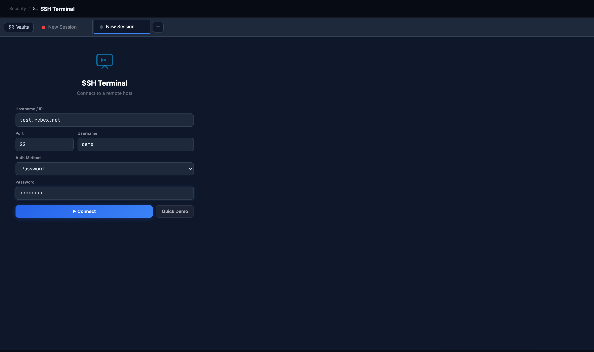
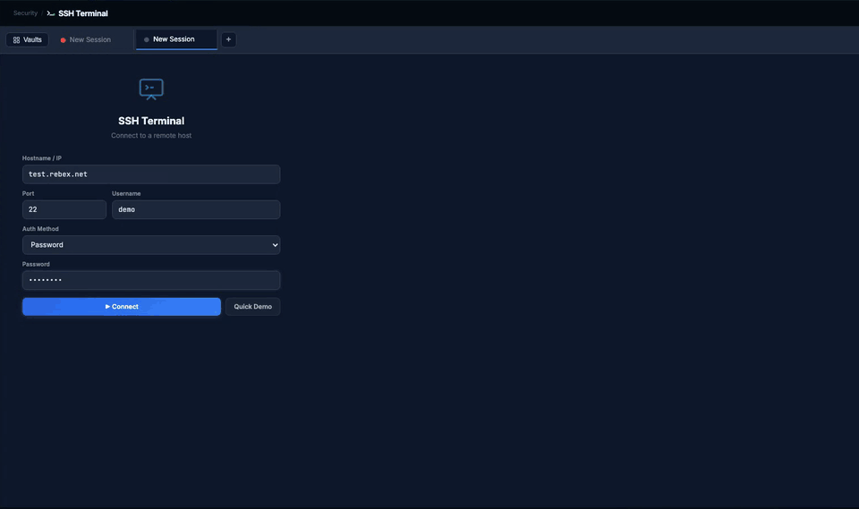
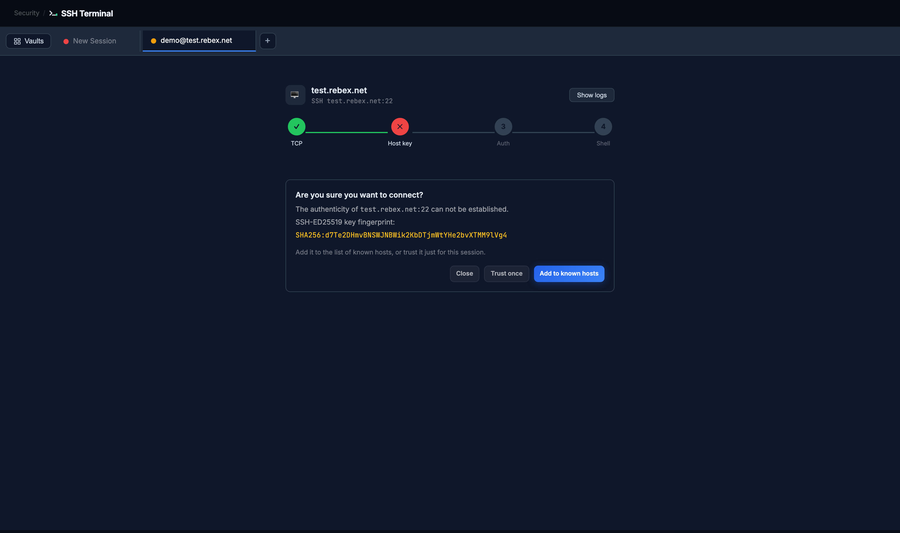
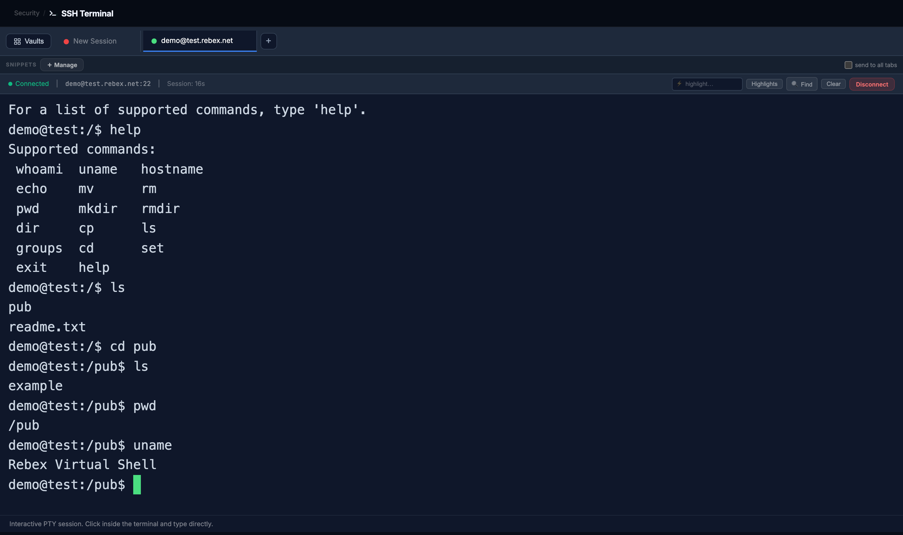

# SSH Terminal

**Can you reach a device's command line from the toolset, with host-key checks, saved sessions and keys, without opening a separate terminal?**

Reach for it when the next step after a diagnosis is a `show` command on the device, or when you want several device sessions in tabs beside the tools that pointed you at them.

## Before you start

| | |
|---|---|
| Inputs | Hostname or IP, port (22), username and an authentication method: a password, a private key pasted as PEM, or a credential from the vault. **Vaults** holds saved sessions and credentials; **Quick Demo** opens a simulated session for a look at the terminal without a device. |
| Duration | A few seconds to connect; the session stays open until you disconnect or the device closes it. |
| Network use | One SSH connection to the host and port, kept open as an interactive session. Nothing inbound. |
| Host keys | A host whose key is not yet known stops the connection at the Host key step and shows the key type and SHA-256 fingerprint. You choose Trust once, Add to known hosts, or Close. |
| Target used here | Rebex's public SSH test server, `test.rebex.net`, with its published test login. Its shell is a sandbox with a dozen commands; nothing on this page is a real device. |

> Note: the terminal shows whatever the device prints. The saved-sessions grid is not shown in these screenshots.

## Running it

Open **Security → SSH Terminal**, click **+** for a new session tab, enter the host, username and password, and click **Connect**. The connection screen steps through TCP, Host key, Auth and Shell; a first connection stops at Host key until you decide about the fingerprint.

Real time, from Connect to the last command.

## Reading the result

**Connection ladder and host-key prompt.** TCP shows the port answered; Host key is where an unknown device stops you. The prompt names the key type and its SHA-256 fingerprint so you can compare it with what the device owner published. **Trust once** connects without remembering the key; **Add to known hosts** remembers it, and a later change of key will be flagged. **Show logs** opens the negotiation log when a step fails.

**Terminal.** An interactive session: click inside and type. The status strip shows the target and the session timer; **Find** and **highlight** search the scrollback, **Clear** empties it, **Disconnect** ends the session. The footer reminds you it is a live PTY, not a command box.

**Tabs, Vaults and Snippets.** Each session is a tab; the dot shows its state and a double-click renames or colours it. **Vaults** is the saved-sessions grid with the credential vault behind it, so a device can be reconnected without retyping anything. **Snippets** are saved commands; with **send to all tabs** ticked, one snippet goes to every open session.

## Export

There is no report from this tool; the session is interactive. Terminal text can be selected and copied, and **Show logs** on the connection screen shows the negotiation log for a failed connection.

## When it doesn't work

| What you see | What it means | What to do |
|---|---|---|
| Ladder stops at TCP | The port did not answer: wrong port, firewall, or host down | Run TCP Ping on port 22 to the same host; check the management ACL |
| Host key prompt on a device you have used before | The device's key changed, or you are reaching a different device on that address | Do not trust it until the change is explained; compare the fingerprint with the device |
| Ladder stops at Auth and a retry panel appears | The password, key or method was rejected | Retry with the Password, Interactive or Key tab; keyboard-interactive is what some devices and RADIUS setups expect |
| Connected, then the prompt never appears | The device is slow to start a shell, or a login banner is waiting for a keypress | Wait, then press Enter once |
| Session drops after a few minutes idle | The device's exec timeout closed it | Reconnect from the tab; raise the exec timeout on the device if it is yours |
| The device only speaks old key exchange or ciphers | A legacy build the modern client does not negotiate with | Connect from a system terminal with the legacy options; note the device for an upgrade |

---

Demonstrated on VIQ Network Toolset v3.1.1 (stable) · captured 2026-08-28 · Virtual IQ AI · USA
