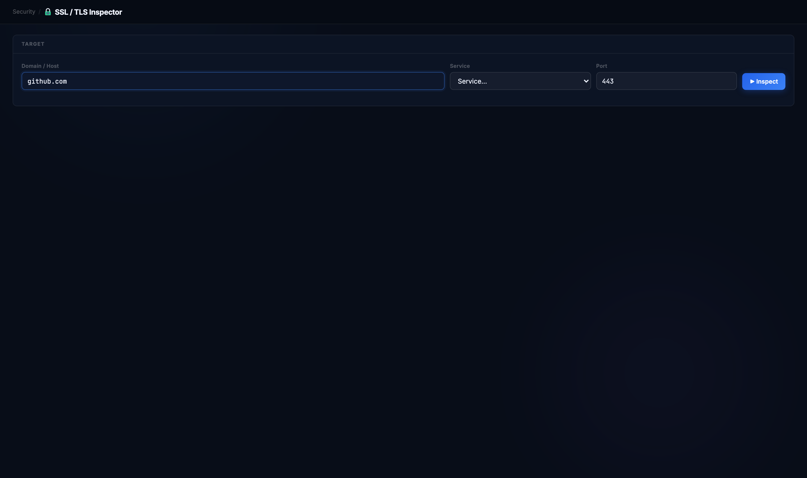
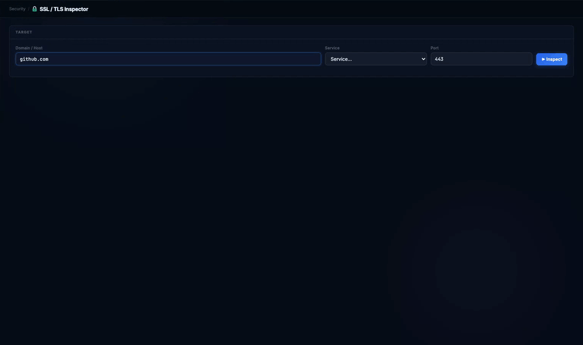
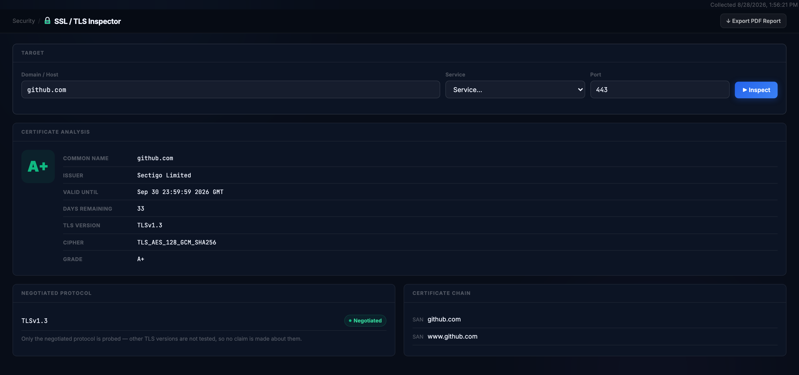
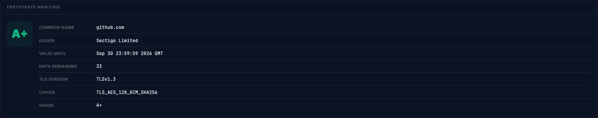
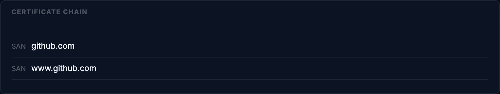
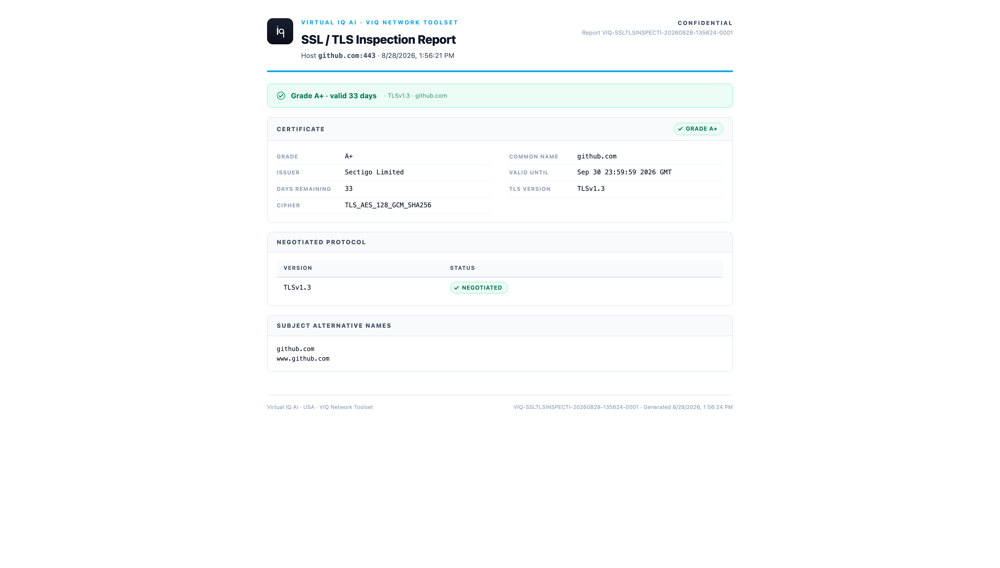

# SSL / TLS Inspector

**Is the certificate on this host valid, who issued it, when does it expire, and what did the handshake negotiate?**

Reach for it when a browser or an application reports a certificate error, when a renewal date is in doubt, or when you need to show which TLS version and cipher a server actually offers, from the workstation, without a browser in the way.

## Before you start

| | |
|---|---|
| Inputs | A hostname or IP and a port. The Service list fills the port for common TLS services (443, 465, 587, 636, 993, 8443, 8883 and others); the default is 443. |
| Duration | A second or two: two TLS handshakes with a 10-second limit each. |
| Network use | Two TCP connections to the host and port. The first handshake verifies the certificate chain against this machine's trust store and checks the hostname; the second reads the certificate, the negotiated TLS version and the cipher. On the mail ports that use STARTTLS (25, 587, 110, 143) the plain connection is upgraded first. Nothing inbound. |
| What is probed | Only the handshake this machine negotiates. The tool does not try every TLS version or cipher, and it says so on the page rather than listing versions it never tested. |
| Trust store | Verification uses this machine's trust store, so a certificate from a private CA grades F here unless that CA is installed locally. |

> Note: nothing on this page identifies the capturing machine; the target is a public host. Exported reports still carry a CONFIDENTIAL mark because they name your internal hosts when you inspect those.

## Running it

Open **Security → SSL Inspector**, enter the host, leave the port at 443 and click **Inspect**.

The result is back in a fraction of a second; the recording is real time.

## Reading the result

**Grade.** One letter for the handshake as a whole. A+ is TLS 1.3 with more than 30 days of validity left; A is the same on TLS 1.2; B is a certificate inside its last 30 days, or a chain the tool could not confirm for a reason other than trust; C is an older protocol. F is a certificate this machine does not trust (expired, self-signed, an unknown CA, or a name that does not match the host) or a handshake that failed on a live connection. A dash means the host could not be reached, so nothing was graded. The certificate here had 33 days left when captured: three more days and the same host would read B.

**Common Name, Issuer, Valid Until, Days Remaining.** Read from the certificate the server presented. Days Remaining is the number to put in the ticket; Issuer tells you whose renewal process to chase.

**TLS Version and Cipher.** What this machine and the server agreed on for this one connection.

**Negotiated Protocol.** The single version that was negotiated, marked as such. The line beneath it says the rest: other versions are not tested, so no claim is made about them. A server that still accepts TLS 1.0 will not be caught here; that needs a scanner that tries every version.

**Certificate Chain.** Despite its title, this card lists the certificate's Subject Alternative Names, up to five, not the issuing chain. It answers "which hostnames is this certificate good for?", which is the question behind most name-mismatch errors. The intermediate and root certificates are not shown.

## Export

**Export PDF Report** opens a one-page report: the host and port, the time, a banner with the grade, days of validity, protocol and common name, then the certificate fields, the negotiated protocol and the Subject Alternative Names.

## When it doesn't work

| What you see | What it means | What to do |
|---|---|---|
| Grade shows a dash; "Connection timed out" or "Connection refused" | The host or port was not reachable, so nothing was graded | Confirm reachability with TCP Ping on the same port; check the port and any firewall |
| Grade F with "certificate verify failed" | Expired, self-signed, issued by a CA this machine does not trust, or the name does not match | Read Valid Until and Issuer; compare the host you typed with the names in the Certificate Chain card |
| Grade F with a handshake error on a live connection | The port answered but did not speak TLS as expected | Wrong port, or a STARTTLS service: pick the service from the list so the port and upgrade match |
| Grade B on a fresh certificate | The chain could not be confirmed for a reason other than trust, often a missing intermediate | Check the server is sending its full chain |
| Days Remaining at 30 or below | Renewal is due; the grade drops to B here and to F at expiry | Renew; run again afterwards to confirm the new Valid Until |
| Common Name differs from the host you typed | Certificates are often issued to another name and cover this host through a SAN | Look for the host in the Certificate Chain card; if it is absent, the browser error is correct |
| Only one protocol listed | By design: only the negotiated version is probed | Use a full TLS scanner when you need the list of every version the server accepts |

---

Demonstrated on VIQ Network Toolset v3.1.1 (stable) · captured 2026-08-28 · Virtual IQ AI · USA
