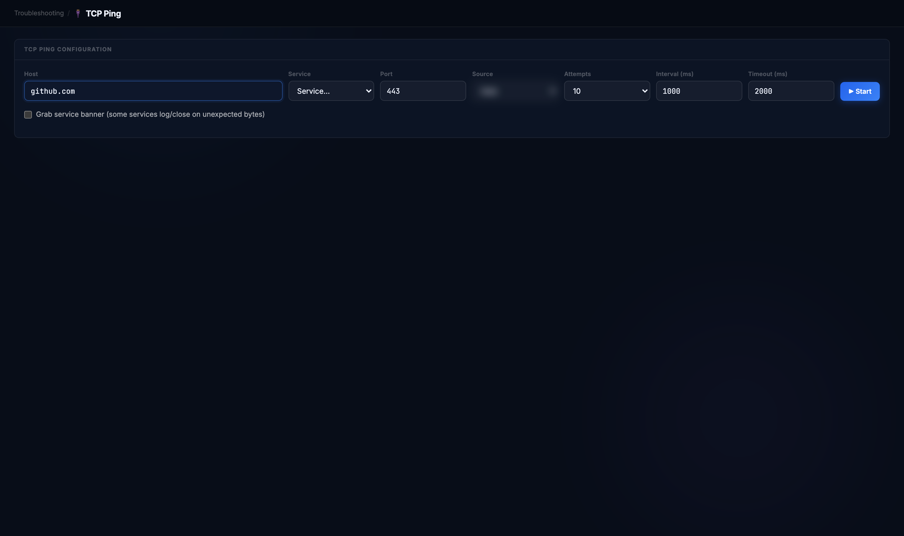
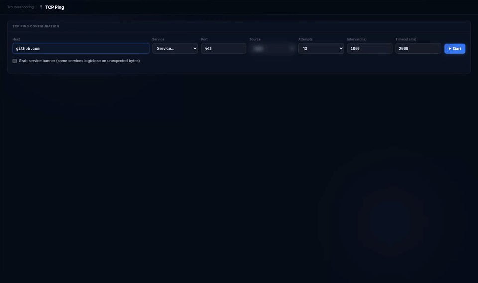
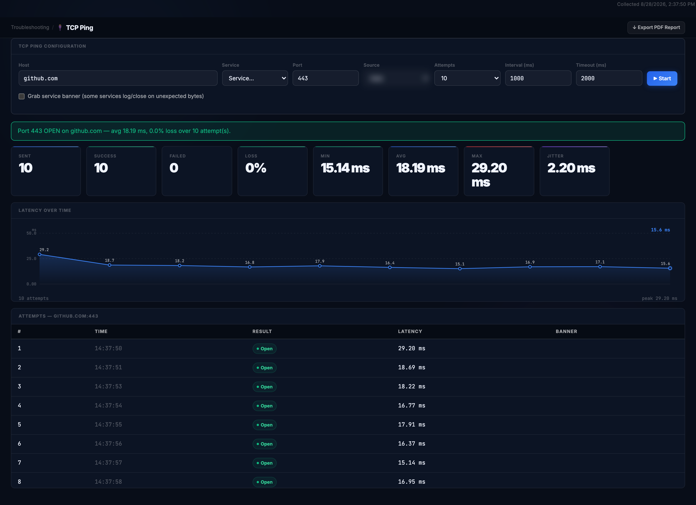
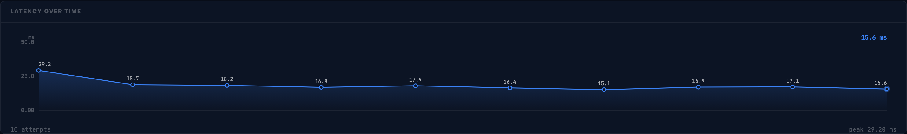
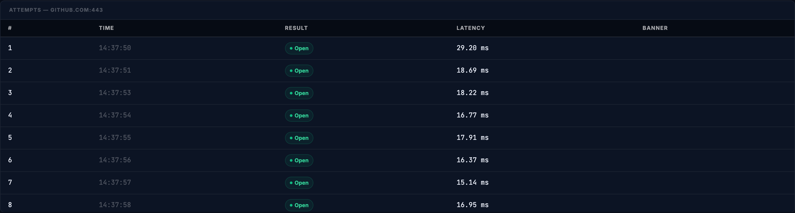
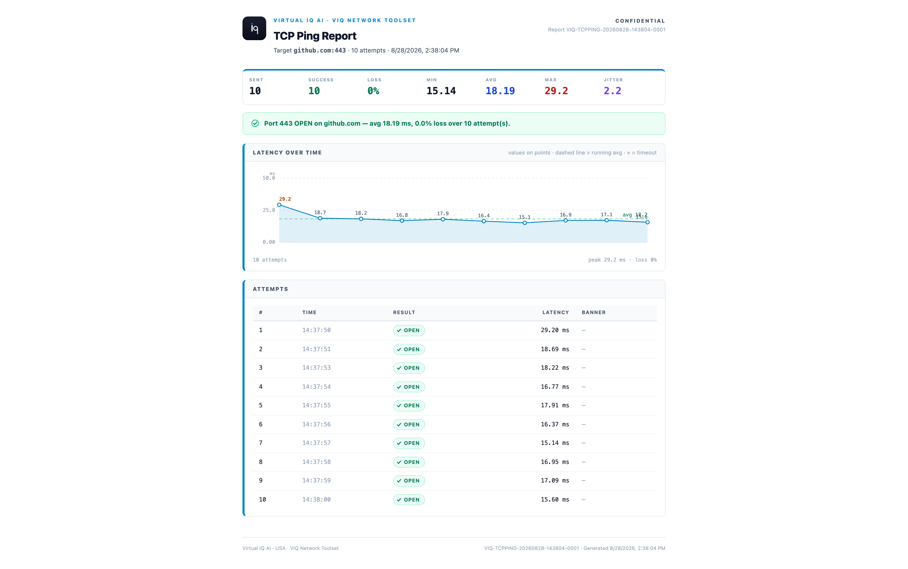

# TCP Ping

**Does this host answer on this port right now, and how consistently?**

Reach for it when ping tells you nothing because ICMP is filtered, or when the question is not "is the host up" but "is the service on port 443 accepting connections, and how fast".

## Before you start

| | |
|---|---|
| Inputs | A host and a port. The Service list fills the port for common services; the default is 443. Source picks the interface to send from (Wi-Fi or wired). Attempts (10; 0 runs until you press Stop), the interval between attempts and the per-attempt timeout, both in milliseconds. |
| Duration | Attempts times interval: ten attempts a second apart take ten seconds. |
| Network use | One TCP handshake per attempt to the host and port, closed as soon as it completes. With **Grab service banner** ticked, the first bytes the service sends are read as well; it is off by default because some services log or drop a connection that sends nothing. Nothing inbound. |
| What it measures | Time to complete the handshake, not application response time. A port can be open and the application behind it still slow. |

> Note: the Source selector names this machine's interfaces and addresses; it is blurred in the screenshots below. The report does not carry them.

## Running it

Open **Troubleshooting → TCP Ping**, enter the host, leave the port at 443 and the attempts at 10, and click **Start**. Each attempt is appended to the table as it completes; **Stop** ends a run early and keeps what has arrived.

Real time: one attempt per second for ten seconds.

## Reading the result

**Banner.** One sentence: whether the port is open, the average handshake time and the loss over the run. It is green when every attempt completed.

**Tiles.** Sent, Success and Failed count attempts; Loss is Failed as a share of Sent. Min, Avg and Max are handshake times; Jitter is how much successive attempts varied. A high Max with a low Avg is one slow handshake, not a slow service.

**Latency over time.** One point per attempt with its value. The first attempt is often the slowest: name resolution and a cold path. A step change part-way through a long run is the thing to look for.

**Attempts.** Every attempt with its result. **Open** is a completed handshake. **Closed** means the host answered with a reset: it is up, but nothing listens on that port. **Filtered** means no answer within the timeout: a firewall dropping the packets, or a host that is down. The banner column fills only when banner grabbing is on and the service speaks first.

## Export

**Export PDF Report** opens the TCP Ping Report: the tiles, the banner, the latency chart with a running-average line and timeouts marked, and the attempts table.

## When it doesn't work

| What you see | What it means | What to do |
|---|---|---|
| Every attempt Filtered | A firewall is dropping the packets, or the host is down | Try a port the host is known to serve; run MTR to see where the path ends |
| Every attempt Closed | The host is up and nothing listens on that port | Check the port; the service may be bound elsewhere or not running |
| A mix of Open and Filtered | Intermittent loss, or a service that stops accepting under load | Raise Attempts to 30 or more to size the loss; compare with another port on the same host |
| Open with a rising Avg over the run | The handshake is slowing: congestion or an overloaded host | Compare a second run from a wired interface via Source |
| Loss 0% but the application is slow | The port accepts connections; the delay is above the handshake | Use SSL / TLS Inspector or the application's own timing; TCP Ping has said what it can |
| Run never ends | Attempts was 0, continuous mode | Press Stop; the results so far are kept |
| Banner column empty with grabbing on | The service waits for the client to speak first (HTTPS does) | Expected; banners come from services such as SSH and SMTP |

---

Demonstrated on VIQ Network Toolset v3.1.1 (stable) · captured 2026-08-28 · Virtual IQ AI · USA
