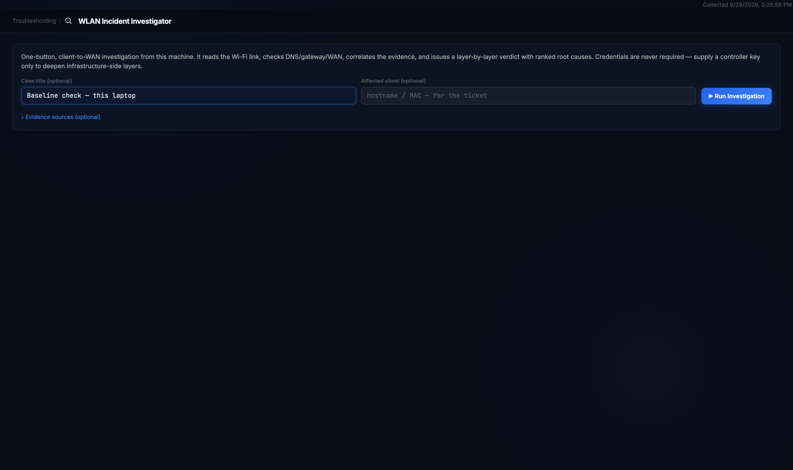
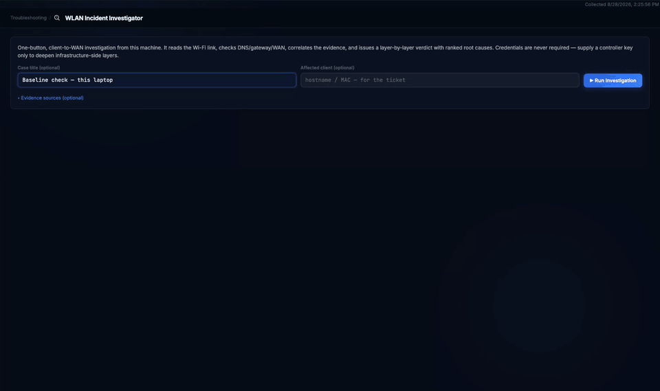
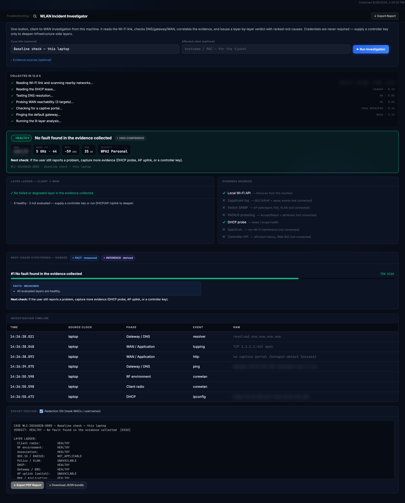
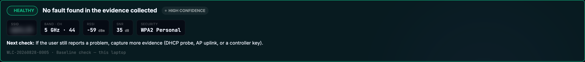
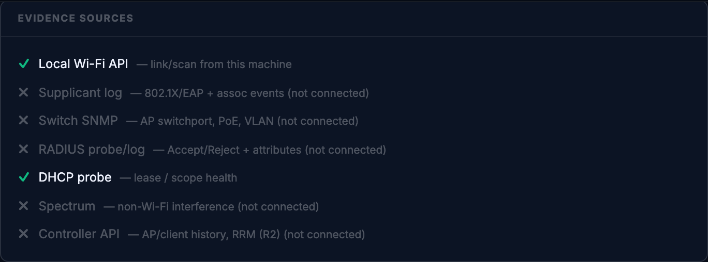
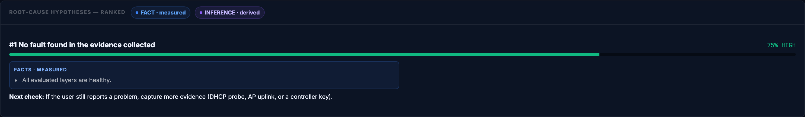
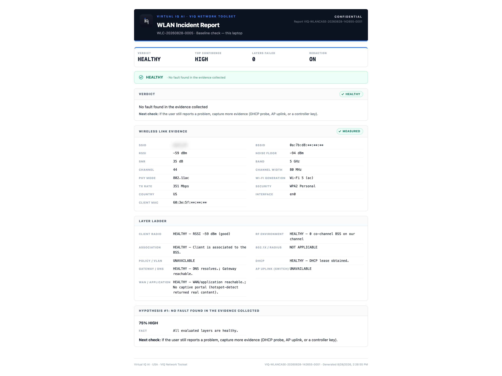

# WLAN Investigator

**Is the Wi-Fi the reason this laptop's connection is bad, and if so, at which layer?**

Reach for it when a user on wireless says the network is slow or keeps dropping and you need one run, from their machine, that reads the link, checks the layers between the client and the internet, and says which one to look at first.

## Before you start

| | |
|---|---|
| Inputs | None required. Optionally a case title and the affected client's name or MAC, both copied into the report for the ticket. A read-only controller API key can be added under Evidence sources to deepen the infrastructure layers when an adapter is available. |
| Duration | About 12 seconds here. Each collection step reports as it finishes. |
| Network use | Reads this machine's Wi-Fi link and scans nearby networks through the local Wi-Fi API; reads the DHCP lease; resolves one name; opens TCP connections to three WAN targets; fetches Apple's captive-portal probe page over HTTP; pings the default gateway. Nothing inbound, no credentials. |
| Permissions | macOS reveals the SSID and BSSID only to apps with Location permission. Without it the run still completes, the network-name chips read "hidden — grant Location", and a notice above the result says why. |
| Scan throttling | macOS refuses a second nearby-network scan within about 30 seconds. Two runs back to back give an INCONCLUSIVE verdict with a note to wait; this is the operating system, not the tool. |

> Note: the result and the report carry this machine's network name, addresses and MAC addresses. The Export Preview's "Redaction ON" setting masks MAC addresses and usernames only; the SSID and IP addresses stay in the report. Those values are blurred in the screenshots below.

## Running it

Open **Troubleshooting → WLAN Investigator**, optionally give the case a title, and click **Run Investigation**.

The first seconds are real time and the rest slightly faster; the run took 12.6 seconds, most of it the nearby-network scan.

## Reading the result

**Verdict banner.** One line for the run: HEALTHY, DEGRADED, FAILED or INCONCLUSIVE, with a headline and a confidence level. INCONCLUSIVE means nothing failed but a load-bearing layer was not assessed; it is never presented as an all-clear. The chips beneath are the link as measured: network name, band and channel, RSSI, SNR and security. **Next check** says what to do if the user still has a problem after a healthy verdict. The case reference is the identifier the report and the case list use.

**Collected in.** The evidence ladder from the run, one row per collection step with what it found and how long it took. It stays on the page so you can see which steps ran and which sources were not connected.

**Layer Ladder — client → WAN.** Nine layers from the client radio to the internet: client radio, RF environment, association, 802.1X / RADIUS, policy / VLAN, DHCP, gateway / DNS, AP uplink and WAN / application. Layers with a problem are shown first; healthy and not-evaluated ones fold beneath a count. UNAVAILABLE means no evidence source for that layer was connected; NOT APPLICABLE means the layer does not exist on this network, such as 802.1X on a WPA2 Personal SSID.

**Evidence Sources.** Which inputs fed this run. A zero-config run uses the local Wi-Fi API and the DHCP probe; the others need a switch, a RADIUS server, a spectrum source or a controller key, and their layers stay UNAVAILABLE until one is connected.

**Root-Cause Hypotheses — ranked.** Each hypothesis carries a confidence and separates what was **measured** from what was **derived**, so a reader can see which statements rest on evidence and which on inference. On a healthy run there is one hypothesis: no fault in the evidence collected.

**Investigation Timeline.** Every event with its time, which clock stamped it, the phase it belongs to and the raw evidence line. This is the table to read when two events need ordering.

**Export Preview.** The report as plain text, with **Redaction ON** masking MAC addresses and usernames. Runs are kept as cases; a Recent cases list beneath the results opens, exports or deletes earlier ones (not shown here).

## Export

**Export Report** opens the WLAN Incident Report: verdict, top confidence, layers failed and redaction state as tiles, then the verdict, the wireless link evidence (SSID, BSSID, RSSI, noise floor, SNR, band, channel and width, PHY mode, Wi-Fi generation, TX rate, security, country, interface and client MAC), the layer ladder and the ranked hypotheses. **Download JSON bundle** saves the same evidence as data.

The BSSID and client MAC in the report show the first three octets and mask the rest; that is the app's own redaction, kept as it appears.

## When it doesn't work

| What you see | What it means | What to do |
|---|---|---|
| Chips read "hidden — grant Location"; a notice above the result | macOS hides SSID and BSSID from apps without Location permission | System Settings → Privacy & Security → Location Services, allow the app, run again |
| INCONCLUSIVE, "nearby scan unavailable this run" | The OS throttled a second scan within about 30 seconds | Wait 30 seconds and run again |
| RF environment, AP uplink or 802.1X show UNAVAILABLE | No evidence source is connected for that layer | Add a controller key, run DHCP or AP-Uplink, or point Switch Health at the access switch |
| Client radio DEGRADED with a low RSSI or SNR | The link itself is weak: distance, obstruction or a stronger neighbouring cell | Move the client or check AP placement; compare with another client at the same spot |
| Gateway / DNS FAILED with the link healthy | The wireless is fine; the problem is on the wired side of the AP | Continue with NetDiag Report or MTR from a wired host |
| Captive portal detected | An intercepting portal is answering instead of the internet | Complete the portal login, or move to an SSID without one |
| The verdict is healthy but the user still complains | The evidence collected has no fault in it | Follow the Next check line: capture more evidence, then look at the application |

---

Demonstrated on VIQ Network Toolset v3.1.1 (stable) · captured 2026-08-28 · Virtual IQ AI · USA
